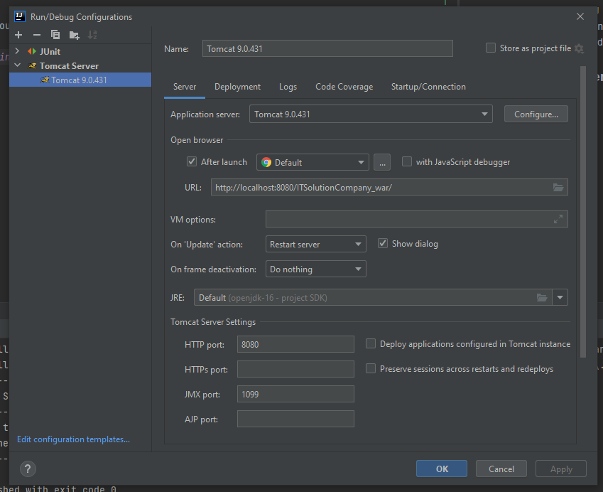
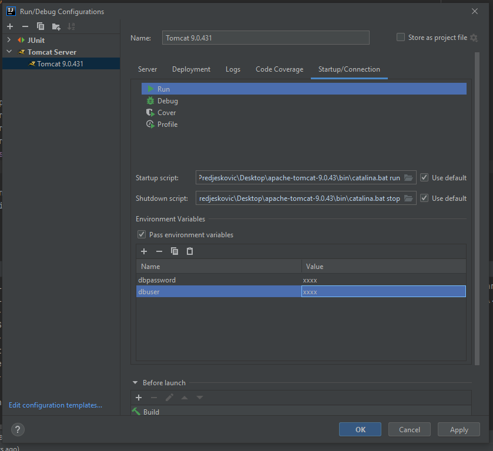
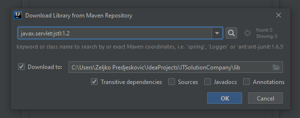

# Solution Company WebApp

### Setup project on IntelliJ

* Open project in IntelliJ

* maven clean, maven install

* add Tomcat runner and your environment variables

* JSP file taglib uri syntax error: create new maven module

### Run project with Jenkins