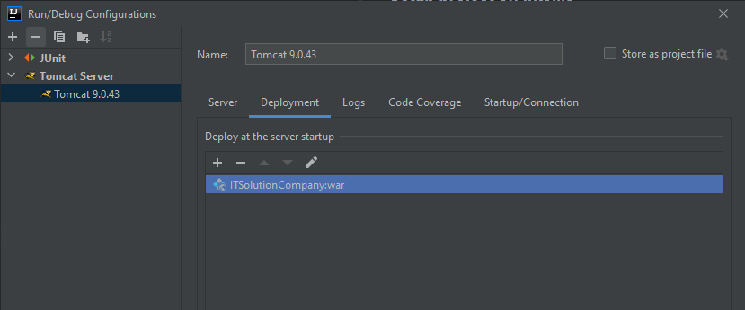

# Solution Company WebApp

### Setup project on IntelliJ

* Open project in IntelliJ

* maven clean, maven install

* add Tomcat runner and your environment variables

* make sure to have the right configuration by picking your tomcat server and deployment artifact

  
  

* add in Pom username and password so the tests can run

### Run project with Jenkins