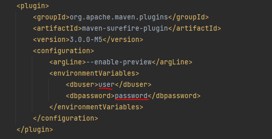

# Solution Company WebApp

### About this project

A Server side rendered web application manage the orders of the customers for a company.
This project's purpose is getting used with tomcat and jdbc. Since I use a lot of Springboot web, I thought, 
getting a perspective of how the springboot web actually works, since it is running on a tomcat server.

### Setup project on IntelliJ

* Open project in IntelliJ

* maven clean, maven install

* add Tomcat runner and your environment variables

* make sure to have the right configuration by picking your tomcat server and deployment artifact

  
  

* add in Pom username and password so the tests can run

### Run project with Jenkins

* Download https://www.jenkins.io/download/ and make sure to install everything

* Create a new element freestyle project and configure it how you want

* Connect it with your github reporitory

* choose commands you want

* save your configure and run it

### Result:

